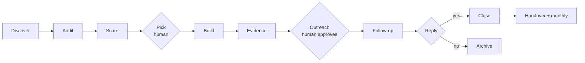

# Acta: pipeline design

Acta non verba. A "build first, pitch second" web studio for small businesses, starting in Birmingham, UK, run as a side hustle with most of the work automated.

The loop: find local businesses with no website or a bad one, build them a fast mobile-first site, show it to them with a price, and convert a small percentage into paying customers. Positioning is a local web developer who enjoys building, not an agency.

---

## Contents

1. [The offer](#1-the-offer)
2. [Constraints that shape the design](#2-constraints-that-shape-the-design)
3. [Pipeline overview](#3-pipeline-overview)
4. [Stage detail](#4-stage-detail)
5. [Data model](#5-data-model)
6. [Tech stack](#6-tech-stack)
7. [Target repo layout](#7-target-repo-layout)
8. [Roadmap](#8-roadmap)
9. [Metrics](#9-metrics)
10. [Decisions still open](#10-decisions-still-open)

---

## 1. The offer

Keep it to one number in the pitch. Everything else is an upsell mentioned in one line.

| Item | Suggested price | Notes |
|---|---|---|
| Site build (finish the preview with their photos and words) | £350 to £500 one-off | Price by vertical. Trades and dental tolerate more than cafes. |
| Hosting, edits, uptime | £20 to £30 / month | This is the real income. Recurring, near-zero marginal cost. |
| .co.uk domain | £15 / year or bundled | Buy through Vercel or a registrar, point at the site. |
| Business email (Google Workspace) | £60 / year + setup fee | High perceived value, trivial to set up. |
| Google Business Profile setup or tidy-up | £75 one-off | Matters more than the site for local search. Strong upsell. |
| Booking or quote form integration | £50 to £100 | Cal.com, a WhatsApp deep link, or a simple form to their inbox. |

What the site must do for a local business, in priority order:

1. Click-to-call and WhatsApp button visible without scrolling on mobile.
2. Opening hours, address, embedded map.
3. Reviews pulled from Google, shown near the top.
4. One page per service, one page per nearby area they serve. This is what ranks.
5. Fast on 4G. HTTPS. Correct name, address and phone matching their Google listing exactly.
6. LocalBusiness schema, sitemap, robots, Open Graph image, sensible titles and meta descriptions.
7. Simple quote or contact form that emails them.

Things that look impressive but don't move the needle: animations, blogs, chatbots, custom illustrations.

---

## 2. Constraints that shape the design

### Legal

- **PECR (cold marketing email).** Sole traders and ordinary partnerships are "individual subscribers" and need consent before you email them marketing. Limited companies and LLPs are "corporate subscribers" and can be emailed without consent, provided you identify yourself and give a working opt-out. The Data (Use and Access) Act 2025 raised PECR fines to UK GDPR levels. Design consequence: the pipeline must classify every lead as `ltd` or `unknown`, and only `ltd` leads go into the email channel. Everyone else gets phone, WhatsApp, Instagram DM, or a walk-in.
- **UK GDPR.** A sole trader's business details are personal data. Building a shortlist from public sources is defensible under legitimate interests, but keep a suppression list, honour any objection immediately, and put a short privacy notice on your own site.
- **Copyright and passing off.** Their photos and logo belong to them. Previews use licensed stock and a text logo, and the pitch says you'll swap in their real photos. Previews live on a `noindex` subdomain so you're never publishing a site under their name.
- **Scraping.** Don't scrape Yell, Checkatrade or Google Maps HTML. Use the official APIs listed in the stack. Pinterest and design galleries are browsed through your own logged-in Chrome at human pace via the Claude in Chrome extension, never a headless scraper, and the findings are cached per vertical so the same search isn't repeated for every lead.
- **Inspiration is not copying.** Competitor and reference sites inform layout, tone and palette. No copy, images or brand assets are lifted from them.

### Platform

- **Vercel Hobby is for non-commercial use.** Previews for a paid service are commercial. Budget for Pro.
- **One codebase and one Vercel project per site, built on a shared kit.** Each lead gets its own `sites/<slug>` app so the agent is free to go bespoke. Shared blocks, SEO plumbing and performance defaults live in a `packages/kit` package every site imports, so a fix there propagates to every site on its next deploy. Previews are served at `<slug>.preview.yourdomain.co.uk` with `noindex`. When someone pays, their domain is attached to the same project.

### Deliverability

- Cold email from a Gmail account gets the account throttled or banned within days. Use a separate sending domain with SPF, DKIM and DMARC, warm it up over two to three weeks, keep volume low, plain text, one link, no tracking pixels.
- Your main domain should never be the sending domain.

### Time

- Fully hands-off doesn't convert. The two things that decide the outcome are choosing the right leads and replying like a human. Budget two to three hours a week for those and automate everything else.

---

## 3. Pipeline overview



| # | Stage | Input | Output | Automation | Phase |
|---|---|---|---|---|---|
| 1 | Discover | Areas × categories config | Raw leads in SQLite | Full | MVP |
| 2 | Audit | Leads with a website | Website health, Lighthouse, screenshots | Full | MVP |
| 3 | Score | Audit + listing data | Opportunity, viability, total, reasons | Full | MVP |
| 4 | Pick | Ranked shortlist | 5 to 20 approved leads / week | Human | MVP |
| 5 | Build | Lead + vertical template | Preview site deployed | Full | Phase 1 |
| 6 | Evidence | Preview + their current site | Before/after screenshots, Lighthouse comparison | Full | Phase 1 |
| 7 | Outreach | Lead + evidence + channel | Draft email or DM script, sent on approval | Semi | Phase 2 |
| 8 | Follow-up | Contacted leads | Two nudges, status updates | Semi | Phase 2 |
| 9 | Close | Won lead | Payment link, domain, handover doc | Semi | Phase 3 |
| 10 | Operate | Live sites | Uptime, edits, monthly billing | Semi | Phase 3 |

---

## 4. Stage detail

### 4.1 Discover

**Sources**

- **Google Places API (New), Text Search.** Query per area and category, for example "plumber in Erdington, Birmingham". Field mask requests name, address, phone, website, rating, review count, business status, opening hours, types, Maps URL. The `websiteUri` field is the primary "has a website" signal. Many results point at a Facebook page or a Yell listing, which count as no real website.
- **Companies House API, advanced company search.** Filter by SIC code and location. Free, official, and the only reliable way to know if a lead is a limited company, which decides the outreach channel. Registered office addresses are often an accountant's, so it is used for entity type, not for the trading address.
- **Match step.** Fuzzy-match Places results to Companies House by name and postcode district. Store the match confidence. Anything below the threshold stays `unknown` and is treated as a sole trader.

**Config** lives in `config/targets.yaml`: a list of Birmingham areas and a list of categories with their Places query string and SIC codes.

**Dedup** on Google place ID, then on normalised phone number.

### 4.2 Audit

Runs against every lead once, and re-runs on a schedule for leads still in play.

**Classification of `website_status`**

| Status | Rule |
|---|---|
| `none` | No website on the listing |
| `facebook_only` | Website is facebook.com, instagram.com, linktr.ee or similar |
| `directory_only` | Website is yell.com, checkatrade.com, bark.com, or another directory |
| `down` | DNS fails, connection refused, 5xx, or timeout |
| `broken` | 4xx, redirect loop, parked domain page, expired certificate |
| `live` | Loads with 2xx |

**Checks on `live` sites**

- HTTPS available and certificate valid. HTTP redirects to HTTPS.
- Time to first byte.
- `<meta name="viewport">` present. Title, meta description, single H1.
- Builder detection from markup and headers: Wix, Squarespace, GoDaddy, Weebly, Jimdo, IONOS, Yell-built, WordPress theme and version.
- Copyright year in footer. Three or more years old is a neglect signal.
- Phone number and email visible on the home page. Do they match the Google listing?
- LocalBusiness schema present.
- Lighthouse mobile via the PageSpeed Insights API: performance, accessibility, best practices, SEO.
- Playwright screenshot at iPhone viewport and at desktop, saved to `data/screenshots/<slug>-{mobile,desktop}.png`.

### 4.3 Score

Two dimensions, both 0 to 100, combined equally. Reasons are stored as a list so the shortlist can say *why* a lead scored well.

**Opportunity** (how much a new site would help)

| Signal | Points |
|---|---|
| `none` or `down` | 100 |
| `facebook_only` or `directory_only` | 90 |
| `broken` | 85 |
| `live` without HTTPS | +30 |
| `live` without viewport meta | +30 |
| Lighthouse mobile performance below 50 | +20 |
| Lighthouse SEO below 70 | +10 |
| Builder is a free-tier or directory-built site | +15 |
| Copyright year three or more years old | +15 |
| No LocalBusiness schema | +5 |

Capped at 100.

**Viability** (are they active, reachable, and likely to pay)

| Signal | Points |
|---|---|
| Business status operational | required |
| Review count 10 or more | +25 |
| Review count 30 or more | +10 more |
| Rating 4.0 or above | +15 |
| Phone number present | +15 |
| Opening hours present | +10 |
| Category in the "pays for marketing" list | +15 |
| Limited company (email channel available) | +10 |

**Total** = (opportunity + viability) / 2. Shortlist filters on viability first, then ranks by total. A brilliant opportunity with two reviews and no phone is not worth a build.

### 4.4 Pick

A human reads the ranked shortlist and approves leads. Output is a status change to `shortlisted` and a chosen channel: `email`, `phone`, `whatsapp`, `dm`, or `walk_in`. Never automate this step. It is where local judgement lives.

### 4.5 Build

An agent runs a general process per lead. The process is fixed, the output is bespoke. It is a Claude Code skill, `/build <slug>`, that the pipeline runs headlessly and that you can also run interactively when you want to steer.

**Phase 1, research.** Three sources, each producing screenshots and notes.

- *Local competitors with good sites.* Pulled from your own leads database: the top five same-category businesses in Birmingham whose audit came back `live` with strong Lighthouse and high viability. Screenshot each, note sections, palette, tone, calls to action, what works and what doesn't. These are the sites the prospect is actually losing work to.
- *Pinterest.* Through the Chrome extension in your logged-in browser: searches like "plumber website design", "trades website hero", ten to twenty pins, saved as screenshots with a one-line note each. Human pace, cached per vertical for 30 days.
- *Modern reference sites.* Design galleries such as Land-book, Godly, SiteInspire and Awwwards, plus a curated per-vertical list in `research/references/` that grows every time the agent finds a good one.

**Phase 2, brief.** `design-brief.md` for the lead: layout direction, palette, type pairing, imagery style, section list and order, tone of voice, three reference screenshots that best fit this business, and a short "avoid" list. This is the document you'd write for a freelancer.

**Phase 3, content.** Written end to end from the listing, reviews, the brief and the competitor copy patterns. Facts are locked: name, phone, address, hours, rating and review quotes come from the listing verbatim. A claims check blocks anything not evidenced in the listing or reviews.

**Phase 4, build.** A new app under `sites/<slug>` from the starter, composing and adapting blocks from `packages/kit` and writing bespoke sections where the brief calls for them. The kit is the floor, not the ceiling. Stock imagery from the licensed library, text logo, Open Graph image, LocalBusiness schema, sitemap and robots come with the starter.

**Phase 5, QA loop.** Lighthouse mobile and Playwright screenshots at phone, tablet and desktop. The agent compares its screenshots against the brief's references and its own gates, fixes, and repeats up to three times. Gates: performance 90 or above, SEO 95 or above, no broken links, alt text on every image, call and WhatsApp links resolve, name and address and phone match the listing exactly.

**Phase 6, deploy and hand to you.** Deployed to its own Vercel project, aliased to `<slug>.preview.yourdomain.co.uk`, `noindex` on. Status becomes `preview_ready`. You review on your phone for two minutes and either approve or send it back with a note the agent acts on.

**Guardrails on the agent.** Time and token cap per build. No copying of copy, images or brand assets from any reference. No claims without evidence. Cannot change facts. Cannot skip the gates. Every research artefact is saved so you can see why it made the choices it made.

**Promotion loop.** After every ten builds, review what the agent wrote bespoke. Anything that appeared three or more times becomes a kit block. The kit gets better, builds get faster, the agent stays free to go beyond it.

### 4.6 Evidence

- Playwright screenshots of the preview on mobile and desktop.
- Lighthouse mobile scores for the preview.
- A side-by-side image: their current site on a phone next to the preview on a phone, with the two performance scores. This one image does most of the selling.

### 4.7 Outreach

- Channel is decided by entity type and by what the Pick step chose.
- Email drafts follow a fixed template: who you are, what you noticed, the link, one price, one upsell line, opt-out and postal address. Under 120 words.
- Phone and DM scripts are generated for non-email leads.
- Nothing is sent without approval in the MVP and Phase 2. Sending is a CLI command that marks the lead `contacted` and schedules follow-ups.

### 4.8 Follow-up

- Day three and day eight nudges, shorter each time. Third contact is the last.
- Any reply moves the lead to `replied` and stops the sequence. Any "no" goes on the suppression list.

### 4.9 Close and operate

- Payment via a Stripe payment link. Deposit or full amount up front.
- Domain purchased and attached through the Vercel API. DNS handled for them.
- Handover document: how to send edits, what's included monthly, how to cancel.
- Monthly billing via Stripe subscription. Uptime check on every live site.

---

## 5. Data model

SQLite, one file at `data/leads.db`.

```
leads
  id, slug, name, category, area, address, postcode, phone_e164,
  website_url, google_place_id, google_maps_url, rating, review_count,
  business_status, opening_hours_json, types_json, source, discovered_at

companies_house
  lead_id, company_number, company_name, company_status, company_type,
  sic_codes_json, registered_postcode, match_confidence, matched_at

audits
  lead_id, audited_at, website_status, http_status, https_ok, ttfb_ms,
  has_viewport, has_title, has_meta_desc, has_h1, builder, copyright_year,
  phone_on_page, phone_matches_listing, has_schema,
  lh_perf, lh_seo, lh_a11y, lh_bp, screenshot_mobile, screenshot_desktop,
  notes

scores
  lead_id, opportunity, viability, total, reasons_json, scored_at

pipeline
  lead_id, status, channel, contacted_at, last_touch_at,
  next_touch_at, notes, updated_at

suppression
  kind (phone|email|domain|place_id), value, reason, added_at
```

Pipeline statuses: `new`, `shortlisted`, `building`, `preview_ready`, `contacted`, `followup_1`, `followup_2`, `replied`, `won`, `lost`, `do_not_contact`.

---

## 6. Tech stack

| Concern | Choice | Why |
|---|---|---|
| Language | TypeScript on Node 22+ | Playwright, Lighthouse, Next.js and Vercel are all native here |
| Package manager | pnpm | |
| Scripts | `tsx` + `commander` CLI | No build step for pipeline scripts |
| Storage | SQLite via `better-sqlite3` | One file, no server, easy to inspect |
| Discovery | Google Places API (New), Companies House API | Official, cheap, no scraping |
| HTML checks | `undici` fetch + `cheerio` | |
| Lighthouse | PageSpeed Insights API | Free, no local Chrome needed for scores |
| Screenshots | Playwright | |
| Config | YAML + `zod` | |
| Site builds | Claude Code `/build` skill, Next.js and Tailwind starter, shared `packages/kit`, one Vercel project per site | Phase 1 |
| Design research | Claude in Chrome for Pinterest and galleries at human pace, web fetch for competitor sites, cached per vertical | Phase 1 |
| Local QA | Lighthouse CLI and Playwright, run by the agent in the QA loop | Phase 1 |
| Email sending | Resend or Postmark on a dedicated sending domain | Phase 2 |
| Payments | Stripe payment links and subscriptions | Phase 3 |
| Domains | Vercel Domains API | Phase 3 |

---

## 7. Target repo layout

```
web-agency-pipeline/
  README.md
  docs/
    PIPELINE.md          this file
    PLAYBOOK.md          manual build and outreach scripts
  config/
    targets.yaml         areas and categories
    scoring.yaml         weights and thresholds
  src/
    cli.ts
    db/                  schema, migrations, queries
    discover/            places.ts, companies-house.ts, match.ts
    audit/               fetch.ts, html-checks.ts, psi.ts, screenshot.ts, classify.ts
    score/               score.ts
    report/              shortlist.ts, pack.ts
    crm/                 status.ts
  .claude/skills/build/  the /build skill: the general process the agent follows (phase 1)
  packages/kit/          shared blocks, SEO plumbing, performance defaults (phase 1)
  starter/               the app every site starts from (phase 1)
  sites/<slug>/          one app per lead, bespoke on top of the kit (phase 1)
  research/              per-vertical inspiration cache and reference list (phase 1)
  data/                  gitignored: leads.db, screenshots/
  out/                   gitignored: shortlists, pitch packs
```

---

## 8. Roadmap

| Phase | Scope | Done when |
|---|---|---|
| 0, MVP | Discover, audit, score, shortlist, pitch pack. Manual build and manual send. | A weekly run produces a ranked shortlist with evidence, and 30 pitches have gone out by hand. |
| 1 | The `/build` skill: research, brief, content, bespoke build on the kit, QA loop, deploy. Evidence images. | A shortlisted lead becomes a reviewed live preview with one command in under an hour of agent time and two minutes of yours. |
| 2 | Outreach drafts, sending on approval, follow-up scheduling, CRM view. | Weekly time spent on outreach admin is under an hour. |
| 3 | Stripe, domain attach, handover docs, uptime, monthly billing. | A "yes" becomes a live site on their domain within a day with no manual DNS work. |
| 4 | Scheduled weekly runs, reporting, expansion beyond Birmingham. | The pipeline runs unattended and you only do Pick and replies. |

Phase 1 is only worth building once Phase 0 has shown real conversions. The decision gates are in the README.

---

## 9. Metrics

Track these from week one, even in a spreadsheet.

- Leads discovered, leads viable (viability above threshold), leads shortlisted.
- Time per manual build. This is the number that justifies Phase 1.
- Pitches sent by channel. Reply rate by channel and by vertical.
- Wins, revenue, monthly recurring revenue.
- Opt-outs and complaints. Should be near zero.

---

## 10. Decisions still open

- Exact pricing per vertical. Start mid-range and adjust on reply rates.
- Per-build agent budget. Start at one hour and a fixed token cap, tighten once the kit has matured.
- Which registrar for domains. Vercel is easiest, a separate registrar is cheaper.
- Whether to offer a "free for the first month" close to reduce friction on the recurring fee.
